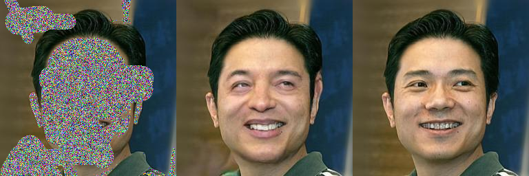
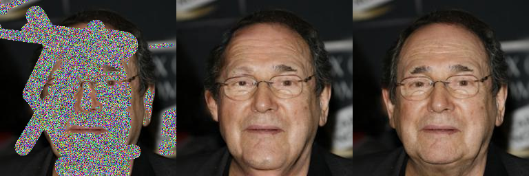
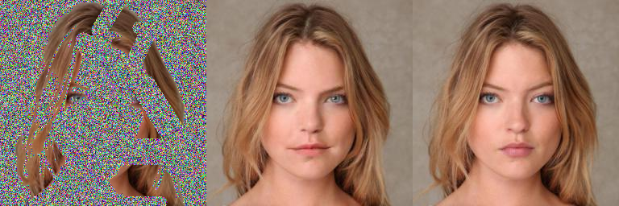
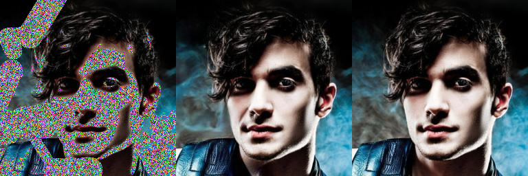

# Palette: Image-to-Image Diffusion Models - CelebA-HQ Face Inpainting

[](https://arxiv.org/abs/2111.05826)
[](https://github.com/AshutoshJoshi9/Palette-Inpainting-Implementation)
[](https://www.kaggle.com/code/AshutoshJoshi9/palette-celebahq-inpainting)
[](https://www.python.org/)
[](https://pytorch.org/)

Implementation of **Palette: Image-to-Image Diffusion Models** for face inpainting on CelebA-HQ dataset (256×256). This project demonstrates high-quality facial image inpainting using conditional diffusion models.

<div align="center">
  
  <p><i>Example inpainting result: Masked Input | Model Prediction | Ground Truth</i></p>
</div>

---

## 📋 Table of Contents

- [Overview](#overview)
- [Features](#features)
- [Results](#results)
- [Installation](#installation)
- [Dataset](#dataset)
- [Pretrained Models](#pretrained-models)
- [Usage](#usage)
- [Evaluation Metrics](#evaluation-metrics)
- [Project Structure](#project-structure)
- [References](#references)
- [Citation](#citation)
- [Acknowledgments](#acknowledgments)
- [License](#license)

---

## 🎯 Overview

This project implements the **Palette** diffusion model for face inpainting tasks. The model uses a conditional denoising diffusion probabilistic model (DDPM) to reconstruct missing regions in facial images with high fidelity.

### Key Highlights

- **Task**: Face inpainting with hybrid masking (center + irregular)
- **Dataset**: CelebA-HQ 256×256 (20 test images)
- **Model**: Palette diffusion model (step 200 checkpoint)
- **Masking**: Hybrid approach combining center masks (~33% coverage) and irregular masks
- **Framework**: PyTorch with Kaggle GPU support

---

## ✨ Features

- 🎨 **High-Quality Inpainting**: State-of-the-art diffusion model for realistic face reconstruction
- 📊 **Comprehensive Metrics**: PSNR, SSIM, MSE, MAE, Cosine Similarity, Boundary Smoothness
- 📈 **Automated Evaluation**: Complete metrics calculation and visualization pipeline
- 🖼️ **Triptych Visualization**: Side-by-side comparison of masked, predicted, and ground truth images
- 📝 **Detailed Reports**: Automatic generation of professional metrics reports and LaTeX tables
- ⚡ **Kaggle-Ready**: Optimized for Kaggle notebook execution with GPU support

---

## 🏆 Results

### Quantitative Metrics

Our implementation achieves the following metrics on 20 CelebA-HQ test images:

#### Pixel-Level Metrics (Masked Region)

| Metric | Mean ± Std | Range | Unit |
|--------|-----------|-------|------|
| **PSNR** | 24.20 ± 3.20 | [16.31, 27.61] | dB |
| **SSIM** | 0.9105 ± 0.0323 | [0.8295, 0.9480] | 0-1 |
| **MSE** | 0.0052 ± 0.0060 | [0.0017, 0.0234] | - |
| **MAE** | 0.0266 ± 0.0172 | [0.0114, 0.0806] | - |

#### Feature-Based Metrics

| Metric | Mean ± Std |
|--------|-----------|
| **Cosine Similarity (Masked)** | 0.9931 ± 0.0078 |
| **Cosine Similarity (Full)** | 0.9942 ± 0.0069 |

#### Region Quality Metrics

| Metric | Mean ± Std | Note |
|--------|-----------|------|
| **Boundary Smoothness** | 0.4714 ± 0.1472 | Lower is better |
| **Unmasked PSNR** | 47.63 ± 3.24 dB | Preservation quality |
| **Mask Coverage** | 57.21 ± 13.50 % | Average mask size |

### Qualitative Results

<div align="center">
  
  
  
  <p><i>More inpainting examples: Left (Masked Input) | Middle (Prediction) | Right (Ground Truth)</i></p>
</div>

### Visualizations

The evaluation pipeline generates:
- **9-panel metrics visualization**: PSNR/SSIM distributions, scatter plots, boundary smoothness analysis
- **Correlation heatmap**: Inter-metric relationships
- **Detailed CSV reports**: Per-image metrics and summary statistics
- **LaTeX tables**: Ready for academic papers

---

## 🚀 Installation

### Prerequisites

- Python 3.8+
- CUDA-capable GPU (recommended)
- 16GB+ RAM
- Kaggle account (for running on Kaggle)

### Setup

1. **Clone the repository**
   ```bash
   git clone https://github.com/AshutoshJoshi9/Palette-Inpainting-Implementation.git
   cd Palette-Inpainting-Implementation
   ```

2. **Install dependencies**
   ```bash
   pip install torch torchvision opencv-python scikit-image pandas matplotlib seaborn scipy
   pip install json5 gdown lpips
   ```

3. **Clone the Palette repository**
   ```bash
   git clone https://github.com/Janspiry/Palette-Image-to-Image-Diffusion-Models
   ```

### Kaggle Setup

1. Upload the notebook `palette-img2img-implementation.ipynb` to Kaggle
2. Enable GPU accelerator: Settings → Accelerator → GPU P100
3. Enable internet access for downloading pretrained models
4. Add the CelebA-HQ dataset (see [Dataset](#dataset) section)

---

## 📁 Dataset

### CelebA-HQ 256×256

**Download**: [CelebA-HQ Dataset](https://www.kaggle.com/datasets/badasstechie/celebahq-resized-256x256)

- **Size**: 30,000 high-quality celebrity face images
- **Resolution**: 256×256 pixels
- **Format**: JPG
- **Usage**: Attach to Kaggle notebook via "Add Data" → Search "CelebA-HQ resized 256"

### Dataset Structure
```
CelebA-HQ resized (256x256)/
└── celeba_hq_256/
    ├── 00000.jpg
    ├── 00001.jpg
    ├── ...
    └── 29999.jpg
```

The notebook automatically:
- Detects the dataset location
- Extracts the first 20 images for testing
- Prepares them for inpainting

---

## 🔧 Pretrained Models

### Palette Inpainting Model (CelebA-HQ 256×256)

**Download**: [Google Drive - Palette Pretrained Models](https://drive.google.com/drive/folders/13YZ2UAmGJ-b7DICr-FDAPM7gctreJEoH)

- **Model**: Palette inpainting checkpoint
- **Training Steps**: 200 (checkpoint used in this project)
- **Architecture**: UNet-based diffusion model
- **Input/Output**: 256×256 RGB images

### Checkpoint Structure
```
ckpt_celebahq/
└── 200/
    ├── 200.state
    └── 200_Network.pth
```

The notebook automatically downloads the checkpoint using `gdown` if not present in Kaggle input data.

---

## 💻 Usage

### Running on Kaggle

1. **Upload the notebook** to Kaggle
2. **Configure settings**:
   - Enable GPU (T4 x2)
   - Enable Internet
   - Add CelebA-HQ dataset
3. **Run cells sequentially**:
   - Cells 1-3: Environment setup
   - Cells 4-7: Dataset and checkpoint preparation
   - Cells 8-11: Model inference
   - Cell 12: Results verification
   - Cells 14-24: Metrics evaluation (optional but recommended)

### Local Execution

If running locally (not recommended due to large model size):

```bash
jupyter notebook palette-img2img-implementation.ipynb
```

**Note**: Adjust paths in the notebook:
- Change `/kaggle/input/` to your local dataset path
- Change `/kaggle/working/` to your desired output directory

---

## 📊 Evaluation Metrics

The comprehensive evaluation pipeline calculates:

### 1. Pixel-Level Metrics
- **PSNR (Peak Signal-to-Noise Ratio)**: Image quality in dB
- **SSIM (Structural Similarity Index)**: Perceptual similarity (0-1)
- **MSE (Mean Squared Error)**: Pixel-wise error
- **MAE (Mean Absolute Error)**: L1 distance

### 2. Feature-Based Metrics
- **Cosine Similarity**: Feature space similarity

### 3. Spatial Quality Metrics
- **Boundary Smoothness**: Gradient magnitude at mask boundaries
- **Unmasked Region PSNR**: Context preservation quality

### 4. Masking Statistics
- **Mask Percentage**: Coverage of masked regions

All metrics are calculated for:
- **Masked regions only** (inpainted area)
- **Full image** (overall quality)
- **Unmasked regions** (context preservation)

---

## 📂 Project Structure

```
palette-face-inpainting/
├── README.md                                    # This file
├── .gitignore                                   # Git ignore rules
├── palette-img2img-implementation.ipynb         # Main implementation notebook
├── Palette: Image-to-Image Diffusion Models.pdf # Original paper
│
├── CelebA-HQ resized (256x256)/                 # Dataset (not tracked)
│   └── celeba_hq_256/
│       └── *.jpg
│
├── celebaHQ20_inpainting_triptychs_PRESENTABLE/ # Results
│   ├── trip_00000.png
│   ├── trip_00001.png
│   └── ...
│
└── outputs/                                      # Generated during evaluation
    ├── inpainting_metrics_detailed.csv
    ├── inpainting_metrics_summary.csv
    ├── comprehensive_metrics_visualization.png
    ├── metrics_correlation_heatmap.png
    ├── metrics_summary_table.csv
    ├── metrics_summary_table.tex
    └── METRICS_REPORT.txt
```

---

## 📚 References

### Original Paper

**Palette: Image-to-Image Diffusion Models**
- **Authors**: Chitwan Saharia, William Chan, Huiwen Chang, Chris A. Lee, Jonathan Ho, Tim Salimans, David J. Fleet, Mohammad Norouzi
- **Conference**: SIGGRAPH 2022
- **Paper**: [arXiv:2111.05826](https://arxiv.org/abs/2111.05826)
- **Abstract**: Palette is a simple and general framework for image-to-image translation using conditional diffusion models. It achieves strong performance on diverse tasks including colorization, inpainting, uncropping, and JPEG restoration.

### Implementation

**Palette-Image-to-Image-Diffusion-Models Repository**
- **GitHub**: [Janspiry/Palette-Image-to-Image-Diffusion-Models](https://github.com/Janspiry/Palette-Image-to-Image-Diffusion-Models)
- **Author**: Janspiry
- **License**: MIT
- **Description**: Unofficial PyTorch implementation of Palette with pretrained models

### Dataset

**CelebA-HQ Dataset**
- **Original Paper**: [Progressive Growing of GANs](https://arxiv.org/abs/1710.10196) (Karras et al., ICLR 2018)
- **Kaggle Dataset**: [CelebA-HQ Resized (256x256)](https://www.kaggle.com/datasets/badasstechie/celebahq-resized-256x256)
- **License**: [CelebA License](http://mmlab.ie.cuhk.edu.hk/projects/CelebA.html)

---

## 📖 Citation

If you use this implementation in your research, please cite:

### This Implementation
```bibtex
@misc{palette-face-inpainting,
  author = {Your Name},
  title = {Palette: Image-to-Image Diffusion Models for Face Inpainting},
  year = {2025},
  publisher = {GitHub},
  howpublished = {\url{https://github.com/YOUR_USERNAME/palette-face-inpainting}}
}
```

### Original Palette Paper
```bibtex
@inproceedings{saharia2022palette,
  title={Palette: Image-to-Image Diffusion Models},
  author={Saharia, Chitwan and Chan, William and Chang, Huiwen and Lee, Chris A. and Ho, Jonathan and Salimans, Tim and Fleet, David J. and Norouzi, Mohammad},
  booktitle={ACM SIGGRAPH 2022 Conference Proceedings},
  year={2022}
}
```

### Palette Implementation
```bibtex
@misc{janspiry2021palette,
  author = {Janspiry},
  title = {Palette-Image-to-Image-Diffusion-Models},
  year = {2021},
  publisher = {GitHub},
  howpublished = {\url{https://github.com/Janspiry/Palette-Image-to-Image-Diffusion-Models}}
}
```

---

## 🙏 Acknowledgments

- **Chitwan Saharia et al.** for the original Palette paper and methodology
- **Janspiry** for the PyTorch implementation and pretrained models
- **Karras et al.** for the CelebA-HQ dataset
- **Kaggle** for providing free GPU resources
- The **PyTorch** and **diffusion models** community for excellent tools and libraries

---

## 📝 License

This project is licensed under the MIT License - see the [LICENSE](LICENSE) file for details.

**Note**: The pretrained models and CelebA-HQ dataset have their own licenses:
- Palette models: [MIT License](https://github.com/Janspiry/Palette-Image-to-Image-Diffusion-Models/blob/main/LICENSE)
- CelebA-HQ: [CelebA License](http://mmlab.ie.cuhk.edu.hk/projects/CelebA.html)

---

## 📧 Contact

For questions or issues, please:
- Open an issue on GitHub
- GitHub: [@AshutoshJoshi9](https://github.com/AshutoshJoshi9)

---

## 🔄 Updates

- **2025-01**: Initial release with CelebA-HQ 256×256 inpainting
- **2025-01**: Added comprehensive metrics evaluation pipeline

---

<div align="center">
  <p>⭐ If you find this project useful, please consider giving it a star!</p>
  <p>Made with ❤️ for the diffusion models community</p>
</div>
